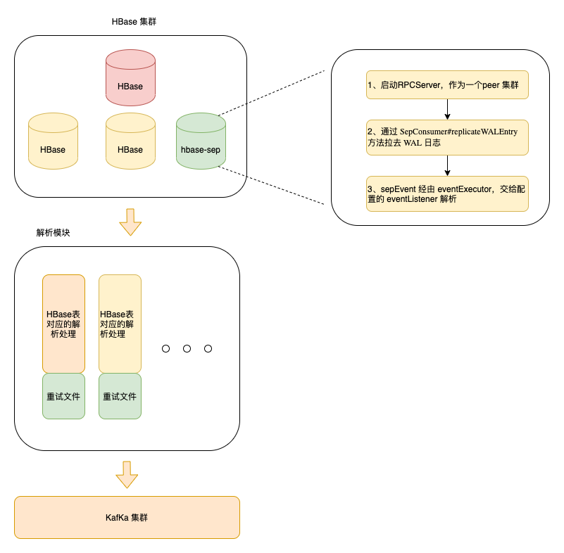

# HBase 数据同步至 Kafka
## 一、基本原理
Hbase 集群的复制功能是通过Zookeeper的协助，从Master集群异步往Slave集群写WAL实现的。可以实现典型的Master-Master模式和Master-Slave模式。经过简单的配置即可实现类似下图中的集群复制：

其原理直接引用社区中的架构图就可以看明白，主集群的hlog中记录了所有针对table的变更（目前不支持ddl的复制），通过实时读取hlog中代表事务的WALEdit来解析变更的数据然后发送到从集群中去。

---
## 二、HLog结构

---
## 三、整体架构

---
## 四、处理流程
WAL 方法入口为：SepConsumer#replicateWALEntry
```
public AdminProtos.ReplicateWALEntryResponse replicateWALEntry(final RpcController controller,
             final AdminProtos.ReplicateWALEntryRequest request) throws ServiceException {
         try {
  
             // TODO Recording of last processed timestamp won't work if two batches of log entries are sent out of order
             long lastProcessedTimestamp = -1;
  
             SepEventExecutor eventExecutor = new SepEventExecutor(listener, executors, 100, sepMetrics);
  
             List<AdminProtos.WALEntry> entries = request.getEntryList();
             CellScanner cells = ((PayloadCarryingRpcController)controller).cellScanner();
  
             for (final AdminProtos.WALEntry entry : entries) {
                 TableName tableName = (entry.getKey().getWriteTime() < subscriptionTimestamp) ? null :
                         TableName.valueOf(entry.getKey().getTableName().toByteArray());
                 Multimap<ByteBuffer, Cell> keyValuesPerRowKey = ArrayListMultimap.create();
                 final Map<ByteBuffer, byte[]> payloadPerRowKey = Maps.newHashMap();
                 int count = entry.getAssociatedCellCount();
                 for (int i = 0; i < count; i++) {
                     if (!cells.advance()) {
                         throw new ArrayIndexOutOfBoundsException("Expected=" + count + ", index=" + i);
                     }
  
                     // this signals to us that we simply need to skip over count of cells
                     if (tableName == null) {
                         continue;
                     }
  
                     Cell cell = cells.current();
                     ByteBuffer rowKey = ByteBuffer.wrap(cell.getRowArray(), cell.getRowOffset(), cell.getRowLength());
                     byte[] payload;
                     KeyValue kv = KeyValueUtil.ensureKeyValue(cell);
                     if (payloadExtractor != null && (payload = payloadExtractor.extractPayload(tableName.toBytes(), kv)) != null) {
                         if (payloadPerRowKey.containsKey(rowKey)) {
                             log.error("Multiple payloads encountered for row " + Bytes.toStringBinary(rowKey)
                                     + ", choosing " + Bytes.toStringBinary(payloadPerRowKey.get(rowKey)));
                         } else {
                             payloadPerRowKey.put(rowKey, payload);
                         }
                     }
                     keyValuesPerRowKey.put(rowKey, kv);
                 }
  
                 for (final ByteBuffer rowKeyBuffer : keyValuesPerRowKey.keySet()) {
                     final List<Cell> keyValues = (List<Cell>) keyValuesPerRowKey.get(rowKeyBuffer);
  
                     final SepEvent sepEvent = new SepEvent(tableName.toBytes(), CellUtil.cloneRow(keyValues.get(0)), keyValues,
                             payloadPerRowKey.get(rowKeyBuffer));
                     // 这里将解析到的 sepEvent 经由 eventExecutor，交给配置的 eventListener 解析
                     eventExecutor.scheduleSepEvent(sepEvent);
                     lastProcessedTimestamp = Math.max(lastProcessedTimestamp, entry.getKey().getWriteTime());
                 }
  
             }
             List<Future<?>> futures = eventExecutor.flush();
             waitOnSepEventCompletion(futures); //这里等待所以的listener 执行完成后，统一上报 给 subscriptionId 对应的 sepMetrics
  
             if (lastProcessedTimestamp > 0) {
                 sepMetrics.reportSepTimestamp(lastProcessedTimestamp);
             }
             return AdminProtos.ReplicateWALEntryResponse.newBuilder().build();
         } catch (IOException ie) {
             throw new ServiceException(ie);
         }
     }

```
但是此代码有一个问题在于 ，上方 waitOnSepEventCompletion 方法，看似需要等待 各个listener 执行完成后才会上报，其实 只是等待 消息发完，即 发后既忘；不会关心 events 是否正确被处理
```
private void scheduleEventBatch(int partition, final List<SepEvent> events) {
       Future<?> future = executors.get(partition).submit(new Runnable() {
           @Override
           public void run() {
               try {
                   long before = System.currentTimeMillis();
                   log.debug("Delivering message to listener");
                   eventListener.processEvents(events);
                   sepMetrics.reportFilteredSepOperation(System.currentTimeMillis() - before);
               } catch (RuntimeException e) {
                   log.error("Error while processing event", e);
                   throw e;
               }
           }
       });
       futures.add(future);
   }
```
需要明确一点：
ReplicationPeer 在HBase master 处，是否会记录当前消费的 offset，这个offset 是否可以获取，是否可以指定消费位置？
答案是：
HBase 自动会记录每一个参与主从复制对HLog文件中，HLogKey 的 sequenceid；在peer 集群回放HLog日志文件时，从 sequenceid 对应的 WALEdit 处开始读取
故，针对  events 发后既忘 的问题，需要控制 对应的HLog 的 sequenceid，确保 events 处理成功后再更新 
参阅源码，这块逻辑由 HMaster 控制，org.apache.hadoop.hbase.master.replication.UpdatePeerConfigProcedure#updateLastPushedSequenceIdForSerialPeer 方法内，对参与同步的每张表进行 sequenceid 更新
所以，我们需要确保 解析到的events ，能够被处理；
一方面，在解析过程中异常处理
二方面，在发送kafka 添加重试

本项目中，我们对每一个topic 中的 异常数据都做了重试


